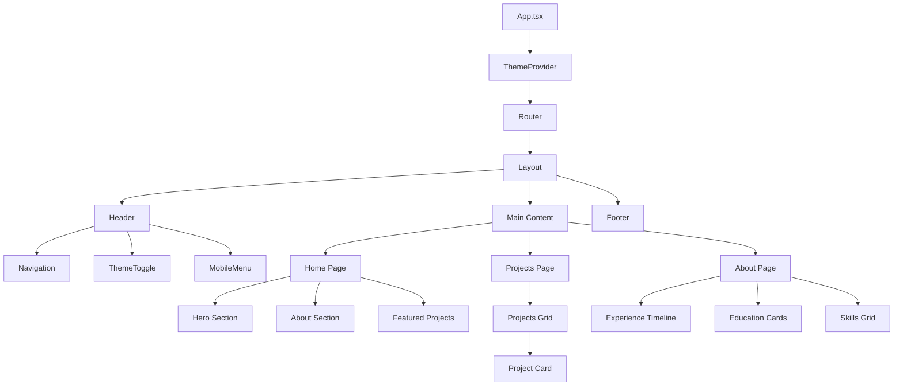
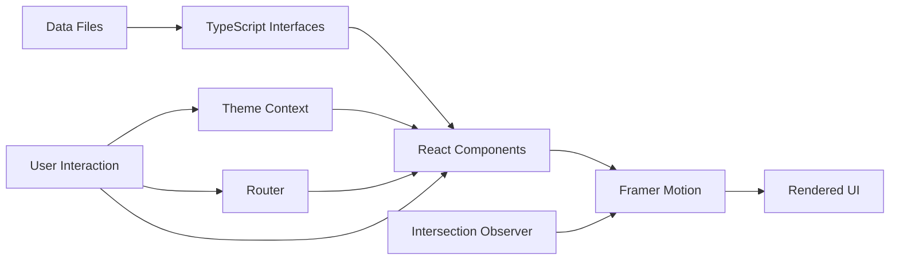
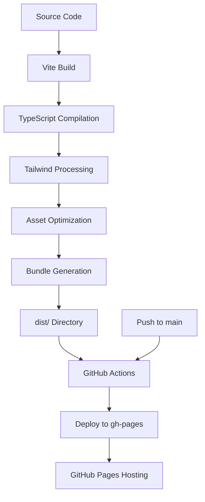

# Modern React Portfolio - Architecture Plan

## Project Overview

Transform the existing Jekyll-based static portfolio into a modern, interactive React application with smooth animations, parallax scrolling, dark/light mode, and a polished UI using Tailwind CSS.

## Technology Stack

### Core Technologies
- **Build Tool**: Vite (fast, modern build tool with HMR)
- **Framework**: React 18+ with TypeScript
- **Styling**: Tailwind CSS v3+
- **Animations**: Framer Motion
- **Routing**: React Router v6
- **Icons**: Lucide React or React Icons

### Additional Libraries
- **react-intersection-observer**: For scroll-triggered animations
- **clsx**: For conditional class names
- **react-helmet-async**: For SEO meta tags
- **react-scroll**: For smooth scrolling navigation

## Project Structure

```
sandeepstele.github.io/
├── public/
│   ├── favicon.svg
│   └── assets/
│       └── resume.pdf
├── src/
│   ├── components/
│   │   ├── common/
│   │   │   ├── Button.tsx
│   │   │   ├── Card.tsx
│   │   │   ├── Container.tsx
│   │   │   ├── Section.tsx
│   │   │   └── ScrollToTop.tsx
│   │   ├── layout/
│   │   │   ├── Header.tsx
│   │   │   ├── Footer.tsx
│   │   │   ├── MobileMenu.tsx
│   │   │   └── ThemeToggle.tsx
│   │   └── sections/
│   │       ├── Hero.tsx
│   │       ├── About.tsx
│   │       ├── Projects.tsx
│   │       ├── Experience.tsx
│   │       ├── Education.tsx
│   │       ├── Skills.tsx
│   │       ├── Publications.tsx
│   │       ├── Awards.tsx
│   │       ├── Courses.tsx
│   │       └── Contact.tsx
│   ├── pages/
│   │   ├── Home.tsx
│   │   ├── ProjectsPage.tsx
│   │   ├── AboutPage.tsx
│   │   └── NotFound.tsx
│   ├── context/
│   │   └── ThemeContext.tsx
│   ├── hooks/
│   │   ├── useScrollAnimation.ts
│   │   ├── useParallax.ts
│   │   └── useTheme.ts
│   ├── data/
│   │   ├── projects.ts
│   │   ├── experience.ts
│   │   ├── education.ts
│   │   ├── skills.ts
│   │   ├── publications.ts
│   │   ├── awards.ts
│   │   └── courses.ts
│   ├── types/
│   │   └── index.ts
│   ├── utils/
│   │   └── animations.ts
│   ├── styles/
│   │   └── index.css
│   ├── App.tsx
│   ├── main.tsx
│   └── vite-env.d.ts
├── .gitignore
├── index.html
├── package.json
├── tsconfig.json
├── tsconfig.node.json
├── vite.config.ts
├── tailwind.config.js
├── postcss.config.js
└── README.md
```

## Key Features & Implementation Details

### 1. Dark/Light Mode Toggle
- **Context API** for global theme state
- **localStorage** persistence
- Smooth transitions between themes
- System preference detection on first load
- Toggle button in header with icon animation

### 2. Smooth Animations
- **Framer Motion** variants for consistent animations
- Fade-in, slide-in, and scale animations
- Stagger children animations for lists
- Page transition animations
- Hover and tap animations for interactive elements

### 3. Parallax Scrolling
- Custom `useParallax` hook
- Background elements move at different speeds
- Subtle depth effect on hero section
- Parallax on section backgrounds

### 4. Interactive Project Cards
- Hover effects with scale and shadow
- Animated borders or gradients
- Tech stack tags with hover states
- Click to expand or navigate to details
- Image lazy loading with blur-up effect

### 5. Responsive Navigation
- Sticky header with backdrop blur
- Mobile hamburger menu with slide-in animation
- Active link highlighting
- Smooth scroll to sections
- Hide/show on scroll for mobile

### 6. Performance Optimizations
- Code splitting with React.lazy
- Image optimization and lazy loading
- Debounced scroll handlers
- Memoized components where appropriate
- Tree-shaking with Vite

## Component Architecture

### Theme System

```typescript
// ThemeContext.tsx
interface ThemeContextType {
  theme: 'light' | 'dark';
  toggleTheme: () => void;
}

// Provides theme state and toggle function
// Persists to localStorage
// Applies theme class to document root
```

### Animation System

```typescript
// animations.ts
export const fadeInUp = {
  initial: { opacity: 0, y: 60 },
  animate: { opacity: 1, y: 0 },
  transition: { duration: 0.6, ease: 'easeOut' }
};

export const staggerContainer = {
  animate: {
    transition: {
      staggerChildren: 0.1
    }
  }
};
```

### Data Structure

```typescript
// types/index.ts
export interface Project {
  id: string;
  title: string;
  description: string;
  stack: string[];
  duration: string;
  link?: string;
  github?: string;
  image?: string;
  featured?: boolean;
}

export interface Experience {
  id: string;
  company: string;
  position: string;
  duration: string;
  location: string;
  description: string[];
}

// Similar interfaces for Education, Skill, Publication, Award, Course
```

## Design System

### Color Palette

**Light Mode:**
- Background: `#fafafa`, `#ffffff`
- Text: `#333333`, `#666666`
- Primary: `#007acc`, `#0066b3`
- Accent: `#00d4ff`
- Border: `#e5e5e5`

**Dark Mode:**
- Background: `#0a0a0a`, `#1a1a1a`
- Text: `#e5e5e5`, `#a0a0a0`
- Primary: `#00d4ff`, `#00b8e6`
- Accent: `#007acc`
- Border: `#2a2a2a`

### Typography
- **Headings**: Inter or Poppins (bold, modern)
- **Body**: System UI stack for performance
- **Code**: JetBrains Mono or Fira Code

### Spacing Scale
- Tailwind's default spacing scale (4px base)
- Consistent section padding: `py-16 md:py-24`
- Container max-width: `1280px`

## Animation Patterns

### Scroll-Triggered Animations
1. **Fade In Up**: Default for most sections
2. **Fade In Left/Right**: Alternating for timeline items
3. **Scale In**: For cards and images
4. **Stagger**: For lists and grids

### Interaction Animations
1. **Hover Scale**: Cards scale to 1.05
2. **Button Press**: Scale to 0.95 on tap
3. **Link Underline**: Animated underline on hover
4. **Theme Toggle**: Rotate and fade icon

### Page Transitions
1. **Route Change**: Fade out/in with slight slide
2. **Modal/Overlay**: Scale and fade
3. **Mobile Menu**: Slide from right

## Routing Strategy

### Routes
- `/` - Home (Hero + About + Featured Projects)
- `/projects` - All Projects
- `/about` - Detailed About (Experience + Education + Skills)
- `/publications` - Publications
- `/awards` - Awards & Achievements
- `/courses` - Courses
- `/contact` - Contact Information
- `*` - 404 Not Found

### Navigation
- Smooth scroll for same-page sections
- React Router for page navigation
- Preserve scroll position on back navigation

## SEO & Meta Tags

### Essential Meta Tags
```html
<meta name="description" content="..." />
<meta name="keywords" content="..." />
<meta name="author" content="Sandeep S" />
<meta property="og:title" content="..." />
<meta property="og:description" content="..." />
<meta property="og:image" content="..." />
<meta property="og:url" content="..." />
<meta name="twitter:card" content="summary_large_image" />
```

### Structured Data
- JSON-LD for Person schema
- Portfolio/CreativeWork schema for projects

## GitHub Pages Deployment

### Vite Configuration
```typescript
// vite.config.ts
export default defineConfig({
  base: '/', // or '/repo-name/' if not custom domain
  build: {
    outDir: 'dist',
    assetsDir: 'assets',
  },
  plugins: [react()],
});
```

### GitHub Actions Workflow
- Build on push to main
- Deploy to gh-pages branch
- Custom domain support (CNAME)

### Build Process
1. `npm run build` - Creates optimized production build
2. Output to `dist/` directory
3. Deploy `dist/` to GitHub Pages

## Accessibility Considerations

### ARIA Labels
- Navigation landmarks
- Button labels for icon-only buttons
- Alt text for all images
- Form labels and error messages

### Keyboard Navigation
- Tab order follows visual order
- Focus indicators visible
- Skip to main content link
- Escape to close modals/menus

### Color Contrast
- WCAG AA compliance minimum
- Test with tools like axe DevTools
- Ensure dark mode has sufficient contrast

## Performance Targets

### Metrics
- **First Contentful Paint**: < 1.5s
- **Largest Contentful Paint**: < 2.5s
- **Time to Interactive**: < 3.5s
- **Cumulative Layout Shift**: < 0.1
- **Lighthouse Score**: > 90

### Optimization Strategies
1. Code splitting by route
2. Lazy load images with blur placeholder
3. Minimize bundle size (tree-shaking)
4. Use CSS containment
5. Debounce scroll handlers
6. Preload critical assets

## Migration Strategy

### Content Migration
1. Extract content from existing HTML files
2. Structure as TypeScript data files
3. Maintain all existing information
4. Enhance with additional metadata (images, tags)

### Asset Migration
1. Keep `favicon.svg` and `resume.pdf`
2. Add project screenshots/thumbnails
3. Optimize images (WebP format)
4. Create placeholder images if needed

### URL Preservation
- Maintain same route structure where possible
- Add redirects for changed URLs
- Update any external links

## Development Workflow

### Phase 1: Setup & Foundation
1. Initialize Vite + React + TypeScript
2. Configure Tailwind CSS
3. Install dependencies
4. Set up project structure
5. Create base components

### Phase 2: Core Features
1. Implement theme system
2. Build layout components (Header, Footer)
3. Create animation utilities
4. Set up routing

### Phase 3: Content Sections
1. Migrate content to data files
2. Build section components
3. Implement animations
4. Add interactive features

### Phase 4: Polish & Optimization
1. Responsive design testing
2. Accessibility audit
3. Performance optimization
4. SEO implementation

### Phase 5: Deployment
1. Configure GitHub Pages
2. Set up deployment workflow
3. Test production build
4. Launch and monitor

## Testing Strategy

### Manual Testing
- Cross-browser testing (Chrome, Firefox, Safari, Edge)
- Mobile device testing (iOS, Android)
- Accessibility testing with screen readers
- Performance testing with Lighthouse

### Automated Testing (Optional)
- Component tests with Vitest + React Testing Library
- E2E tests with Playwright
- Visual regression tests

## Future Enhancements

### Potential Additions
1. Blog section with MDX support
2. Project filtering and search
3. Contact form with backend integration
4. Analytics integration (Google Analytics, Plausible)
5. RSS feed for blog
6. Internationalization (i18n)
7. Progressive Web App (PWA) features
8. Advanced animations (GSAP, Lottie)

## Dependencies Overview

### Production Dependencies
```json
{
  "react": "^18.3.1",
  "react-dom": "^18.3.1",
  "react-router-dom": "^6.22.0",
  "framer-motion": "^11.0.0",
  "react-intersection-observer": "^9.8.0",
  "clsx": "^2.1.0",
  "lucide-react": "^0.344.0",
  "react-helmet-async": "^2.0.4"
}
```

### Dev Dependencies
```json
{
  "@vitejs/plugin-react": "^4.2.1",
  "vite": "^5.1.0",
  "typescript": "^5.3.3",
  "tailwindcss": "^3.4.1",
  "postcss": "^8.4.35",
  "autoprefixer": "^10.4.17",
  "@types/react": "^18.2.55",
  "@types/react-dom": "^18.2.19"
}
```

## Configuration Files

### Tailwind Config Highlights
- Custom color palette for light/dark modes
- Custom animations and keyframes
- Typography plugin for rich text
- Container queries plugin

### TypeScript Config
- Strict mode enabled
- Path aliases for clean imports
- JSX preserve for React

### Vite Config
- React plugin
- Path resolution
- Build optimization
- Dev server configuration

## Mermaid Diagram: Component Hierarchy



## Mermaid Diagram: Data Flow



## Mermaid Diagram: Build & Deploy Process



## Success Criteria

### Functional Requirements
- ✅ All content from original site migrated
- ✅ Dark/light mode toggle working
- ✅ Smooth animations on scroll
- ✅ Parallax effects implemented
- ✅ Responsive on all screen sizes
- ✅ Interactive project cards
- ✅ Working navigation and routing

### Non-Functional Requirements
- ✅ Lighthouse score > 90
- ✅ Fast load times (< 3s)
- ✅ Accessible (WCAG AA)
- ✅ SEO optimized
- ✅ Cross-browser compatible
- ✅ Mobile-friendly

### User Experience
- ✅ Intuitive navigation
- ✅ Smooth, polished animations
- ✅ Clear visual hierarchy
- ✅ Professional appearance
- ✅ Easy to update content

## Conclusion

This architecture provides a solid foundation for a modern, performant, and maintainable React portfolio. The modular structure allows for easy updates and additions, while the chosen technologies ensure a great user experience with smooth animations, responsive design, and excellent performance.

The migration from Jekyll to React will result in a more interactive and engaging portfolio that showcases your technical skills while maintaining all the valuable content from your current site.
